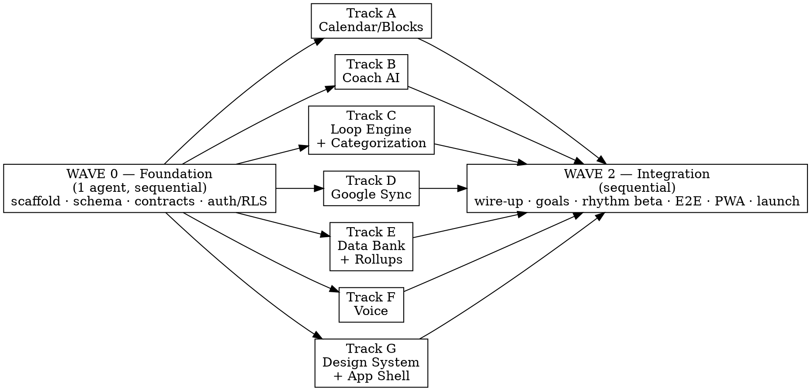

# Bogi Implementation Plan

> **For agentic workers:** REQUIRED SUB-SKILL: Use superpowers:subagent-driven-development (recommended) or superpowers:executing-plans to implement this plan task-by-task. Steps use checkbox (`- [ ]`) syntax for tracking.
>
> **This plan is optimized for parallelization.** Read §0 (Parallelization Model) and §1 (Shared Contracts) before dispatching any agent. Wave 0 is sequential and blocks everything. Wave 1 tracks run concurrently — each in its own git worktree (superpowers:using-git-worktrees), each owning a disjoint file set. Cross-track dependencies are satisfied **only** through Wave-0 contracts, never by reading another track's implementation files.

**Goal:** Build Bogi — a private AI accountability coach web app whose one job is to show the user the gap between their calendar plan (intention) and what they actually did (reality), accumulating a longitudinal time data bank.

**Architecture:** Next.js (App Router, TS) + Supabase (Postgres/RLS/Auth/Realtime/Edge Functions) + Anthropic Claude (planner/coach/categorizer) + two-way Google Calendar sync. Text + voice from day one. The product surface is one loop: PLAN → LIVE → ACCOUNT → DATA BANK.

**Tech Stack:** Next.js 15 / React 19 / TypeScript / Tailwind + shadcn/ui / Zustand · Supabase JS + Postgres + pgvector + Deno Edge Functions · Anthropic SDK · Google Calendar API · Vitest + Playwright · Vercel + Supabase hosting.

**Source spec:** `docs/IMPLEMENTATION_SPEC.md` (product definition, personas, data model rationale, privacy posture). This plan turns that spec into executable, parallelizable tasks.

---

## 0. Parallelization Model (read first)

### 0.1 Wave structure



- **Wave 0 — Foundation.** ONE agent, no parallelism. Produces the contracts (§1) every track compiles against. Nothing else starts until Wave 0 is merged to the integration branch.
- **Wave 1 — Tracks A–G.** SEVEN agents in parallel, one git worktree each. Each track is a self-contained, independently testable slice. They never edit a shared file (see §0.3 ownership matrix). They depend on each other only via Wave-0 types/zod/db-layer.
- **Wave 2 — Integration.** ONE agent (or a short sequential mini-wave). Wires tracks into end-to-end flows, builds features that genuinely span tracks (goals, rhythm beta, ask-AI), runs full Playwright E2E, PWA, launch hardening.

### 0.2 Why this is safe to parallelize

The classic failure mode of parallel agents is two agents editing the same file or assuming different shapes for a shared type. We eliminate both:

1. **Contract-first.** Wave 0 freezes the DB schema, generated TS types, zod validators, and API route signatures. A track that needs "a block" imports `Block` from `@/lib/contracts` — it does not reach into Track A's UI.
2. **Disjoint file ownership.** Every path in the repo is owned by exactly one track (§0.3). An agent may only create/modify files under its owned roots. Shared edits (e.g. registering a route in a barrel file) are forbidden in Wave 1 — instead each track exports from its own module and Wave 2 wires the barrel.
3. **Mock the seam, don't import it.** Track C (loop engine) needs blocks, but tests against the `Block` contract + an in-memory fake of the `blocks` db-layer function — never against Track A's React components.

### 0.3 File-ownership matrix (authoritative — no overlaps)

| Track | Owned roots (create/modify only here) |
|---|---|
| **Wave 0** | `package.json`, `tsconfig.json`, `next.config.*`, `tailwind.config.*`, `.github/`, `supabase/migrations/`, `lib/contracts/**`, `lib/db/**`, `lib/supabase/**`, `app/(auth)/**`, `middleware.ts`, `lib/env.ts`, `vitest.config.ts`, `playwright.config.ts` |
| **A — Calendar/Blocks** | `lib/blocks/**`, `app/api/blocks/**`, `app/(app)/today/**`, `components/calendar/**` |
| **B — Coach AI** | `lib/ai/**`, `app/api/coach/**`, `app/(app)/coach/**`, `components/coach/**` |
| **C — Loop Engine** | `lib/loop/**`, `lib/reality/**`, `app/api/reality-logs/**`, `supabase/functions/block-watcher/**`, `supabase/functions/categorize/**`, `components/checkin/**` |
| **D — Google Sync** | `lib/google/**`, `app/api/google/**`, `supabase/functions/sync-google/**` |
| **E — Data Bank** | `lib/databank/**`, `app/api/data-bank/**`, `app/api/ask/**`, `app/(app)/data-bank/**`, `supabase/functions/rollups/**`, `components/databank/**` |
| **F — Voice** | `lib/voice/**`, `components/voice/**` |
| **G — Design System** | `components/ui/**`, `app/(app)/layout.tsx`, `app/globals.css`, `lib/design/**`, `components/shell/**` |
| **Wave 2** | barrel/registry files, `app/(app)/page.tsx` home wiring, `app/(app)/goals/**`, `lib/rhythm/**`, `supabase/functions/rhythm/**`, `e2e/**`, `app/manifest.ts`, service worker |

> Rule enforced in every Wave-1 agent prompt: *"You may only create or modify files under your owned roots listed above. If you believe you need to touch a file outside them, STOP and report it as a contract gap — do not edit it."*

### 0.4 Branch / worktree strategy (superpowers:using-git-worktrees)

- Wave 0 on branch `wave0/foundation`, merged to `integration` when green.
- Each Wave-1 track in its own worktree off `integration`: `track/a-blocks`, `track/b-coach`, … `track/g-design`.
- Each track merges back to `integration` independently when its tasks pass. Because file sets are disjoint, merges do not conflict.
- Wave 2 runs on `integration`.

### 0.5 Dispatch recipe (superpowers:subagent-driven-development)

1. Run Wave 0 inline or as a single subagent. Verify green, merge to `integration`.
2. Dispatch Tracks A–G as 7 parallel subagents, each with: its worktree, its owned-roots constraint, the §1 contracts pasted in, and its task list from this plan. Each returns a summary + green test run.
3. Review each summary, merge each track to `integration`, run the full suite after each merge.
4. Run Wave 2 sequentially.

---

## 1. Shared Contracts (Wave 0 output — every track imports these)

These are the **only** types tracks may share. Wave 0 must implement them exactly as written; tracks must not redefine them.

### 1.1 Entity types — `lib/contracts/types.ts`

```typescript
export type UUID = string;
export type ISODateTime = string; // ISO 8601, always UTC in storage

export type BlockStatus = 'planned' | 'active' | 'ended' | 'logged' | 'skipped';
export type BlockSource = 'bogi' | 'google';

export interface Block {
  id: UUID;
  userId: UUID;
  googleEventId: string | null;
  title: string;
  intent: string | null;            // coach-clarified concrete intention
  startsAt: ISODateTime;
  endsAt: ISODateTime;
  source: BlockSource;
  status: BlockStatus;
  plannedCategoryId: UUID | null;
  createdAt: ISODateTime;
  updatedAt: ISODateTime;
}

export interface RealityLog {
  id: UUID;
  userId: UUID;
  blockId: UUID | null;             // null = free-form gap log
  startsAt: ISODateTime;
  endsAt: ISODateTime;
  rawText: string;                  // user's own words (typed or transcribed)
  didAsPlanned: boolean | null;     // null = partial
  fulfillment: number | null;       // 0..100
  reason: string | null;
  inControl: boolean | null;
  categoryId: UUID | null;
  subcategory: string | null;
  description: string | null;
  source: 'manual' | 'voice';
  createdAt: ISODateTime;
}

export interface Category {
  id: UUID;
  userId: UUID | null;              // null = global seed
  name: string;
  parentId: UUID | null;
  kind: 'category' | 'subcategory' | 'leaf';
  color: string | null;
}

export interface Goal {
  id: UUID;
  userId: UUID;
  title: string;
  horizon: 'week' | 'month' | 'year';
  periodStart: string;              // YYYY-MM-DD
  periodEnd: string;
  targetMetric: string | null;
  status: 'open' | 'hit' | 'missed' | 'partial';
}

export interface RhythmPattern {
  id: UUID;
  userId: UUID;
  patternKey: string;
  summary: string;
  evidence: Record<string, unknown>;
  confidence: number;               // 0..1
}

export interface TimeRollup {
  userId: UUID;
  period: 'day' | 'week' | 'month' | 'year';
  periodStart: string;              // YYYY-MM-DD
  categoryId: UUID | null;
  plannedMinutes: number;
  actualMinutes: number;
}

// The signature object: the gap between intention and reality for one block.
export interface PlanRealityGap {
  block: Block;
  logs: RealityLog[];
  plannedMinutes: number;
  actualMinutes: number;            // minutes that matched the intention
  fulfillment: number;              // 0..100 aggregate
  leakedMinutes: number;            // plannedMinutes - actualMinutes (clamped ≥0)
}
```

### 1.2 db-layer interface — `lib/db/index.ts` (signatures only; Wave 0 implements)

```typescript
import type { Block, RealityLog, Category, Goal, TimeRollup, RhythmPattern, UUID, ISODateTime } from '@/lib/contracts/types';

export interface Db {
  blocks: {
    create(input: Omit<Block, 'id'|'createdAt'|'updatedAt'|'status'|'source'> & Partial<Pick<Block,'status'|'source'|'googleEventId'>>): Promise<Block>;
    update(id: UUID, patch: Partial<Block>): Promise<Block>;
    delete(id: UUID): Promise<void>;
    listInRange(userId: UUID, from: ISODateTime, to: ISODateTime): Promise<Block[]>;
    findEndedUnlogged(now: ISODateTime): Promise<Block[]>;
    get(id: UUID): Promise<Block | null>;
  };
  realityLogs: {
    create(input: Omit<RealityLog,'id'|'createdAt'>): Promise<RealityLog>;
    listForBlock(blockId: UUID): Promise<RealityLog[]>;
    listInRange(userId: UUID, from: ISODateTime, to: ISODateTime): Promise<RealityLog[]>;
  };
  categories: { listForUser(userId: UUID): Promise<Category[]>; create(input: Omit<Category,'id'>): Promise<Category>; };
  goals: { listForUser(userId: UUID, horizon?: Goal['horizon']): Promise<Goal[]>; create(input: Omit<Goal,'id'>): Promise<Goal>; update(id: UUID, patch: Partial<Goal>): Promise<Goal>; };
  rollups: { upsert(r: TimeRollup): Promise<void>; query(userId: UUID, period: TimeRollup['period'], periodStart: string): Promise<TimeRollup[]>; };
  rhythm: { listForUser(userId: UUID): Promise<RhythmPattern[]>; upsert(p: Omit<RhythmPattern,'id'>): Promise<RhythmPattern>; };
}

export function getDb(accessToken: string): Db; // RLS-scoped client (auth.uid())
export function getServiceDb(): Db;             // service-role, ONLY in Edge Functions
```

### 1.3 zod validators — `lib/contracts/schemas.ts`

Wave 0 provides a zod schema per entity (`blockSchema`, `realityLogSchema`, …) and per API request body (`createBlockRequest`, `createRealityLogRequest`, `askRequest`, …). Tracks import these for request validation — they do not write their own.

### 1.4 AI tool contract — `lib/contracts/ai-tools.ts`

The names and JSON-schemas of the Claude tools (so Track B implements them and Track A/C implement the executors against the same shapes):

```typescript
export const AI_TOOLS = ['create_block','move_block','delete_block','create_reality_log','get_schedule','get_rhythm','get_goals'] as const;
export type AiToolName = typeof AI_TOOLS[number];
export interface AiToolExecutor { name: AiToolName; run(args: unknown, ctx: { userId: UUID; accessToken: string }): Promise<unknown>; }
```

### 1.5 API route contract (paths + request/response types)

| Route | Method | Request (zod) | Response |
|---|---|---|---|
| `/api/blocks` | POST/PATCH/DELETE | `createBlockRequest` | `Block` |
| `/api/blocks` | GET `?from&to` | query | `Block[]` |
| `/api/reality-logs` | POST | `createRealityLogRequest` | `RealityLog` |
| `/api/coach` | POST | `coachRequest` | SSE stream |
| `/api/data-bank` | GET `?period&start` | query | `{ rollups: TimeRollup[]; gaps: PlanRealityGap[] }` |
| `/api/ask` | POST | `askRequest` | `{ answer: string; citations: UUID[] }` |
| `/api/google/connect` / `/callback` / `/webhook` | — | — | OAuth / 200 |

---

## WAVE 0 — Foundation (sequential, 1 agent)

**Files:** see Wave-0 owned roots in §0.3. **Goal:** green test harness + all §1 contracts implemented + auth/RLS working.

### Task 0.1: Scaffold project

- [ ] **Step 1:** Create Next.js app with TS, App Router, Tailwind.

```bash
npx create-next-app@latest bogi --typescript --tailwind --app --eslint --src-dir=false --import-alias "@/*"
cd bogi && npm i @supabase/supabase-js @supabase/ssr zod @anthropic-ai/sdk zustand
npm i -D vitest @vitejs/plugin-react @testing-library/react jsdom @playwright/test
```

- [ ] **Step 2:** Add `vitest.config.ts`.

```typescript
import { defineConfig } from 'vitest/config';
import react from '@vitejs/plugin-react';
export default defineConfig({
  plugins: [react()],
  test: { environment: 'jsdom', globals: true, setupFiles: [] },
  resolve: { alias: { '@': new URL('.', import.meta.url).pathname } },
});
```

- [ ] **Step 3:** Add npm scripts (`test`, `test:run`, `e2e`, `typecheck`). Run `npm run typecheck` → expect PASS (empty project).
- [ ] **Step 4:** Commit. `git commit -m "chore: scaffold Next.js + Supabase + test harness"`

### Task 0.2: Environment + Supabase clients

- [ ] **Step 1:** Write test `lib/env.test.ts` asserting `env` throws when a required var is missing and returns typed values when present.
- [ ] **Step 2:** Run → FAIL (`env` undefined).
- [ ] **Step 3:** Implement `lib/env.ts` (zod-validated `process.env`: `NEXT_PUBLIC_SUPABASE_URL`, `NEXT_PUBLIC_SUPABASE_ANON_KEY`, `SUPABASE_SERVICE_ROLE_KEY`, `ANTHROPIC_API_KEY`, `GOOGLE_CLIENT_ID/SECRET`, `TOKEN_ENC_KEY`).
- [ ] **Step 4:** Run → PASS. Implement `lib/supabase/server.ts`, `lib/supabase/client.ts` (`@supabase/ssr`).
- [ ] **Step 5:** Commit.

### Task 0.3: Database schema migration

- [ ] **Step 1:** Create `supabase/migrations/0001_core.sql` with the full schema from `docs/IMPLEMENTATION_SPEC.md §4` (profiles, google_accounts, blocks, reality_logs, categories, goals, coach_messages, rhythm_patterns, time_rollups) **plus** `create extension if not exists vector;` and `create extension if not exists pgcrypto;`.
- [ ] **Step 2:** Create `supabase/migrations/0002_rls.sql`: enable RLS on every user-owned table; policy `using (auth.uid() = user_id)` for select/insert/update/delete; categories also allow `user_id is null` on select.
- [ ] **Step 3:** Apply locally: `supabase db reset`. Expected: migrations apply clean.
- [ ] **Step 4:** Seed global category taxonomy in `0003_seed_categories.sql` (Work, Study, Health, Social→"Activity with friend", Admin, Leisure, …).
- [ ] **Step 5:** Commit.

### Task 0.4: RLS enforcement test (mandatory privacy gate)

- [ ] **Step 1:** Write `lib/db/rls.test.ts`: with two seeded users, user A's client cannot read user B's blocks/reality_logs (expect empty/denied).
- [ ] **Step 2:** Run → FAIL (db layer not built).
- [ ] **Step 3:** Implement `lib/db/index.ts` per §1.2 (RLS-scoped + service clients).
- [ ] **Step 4:** Run → PASS (cross-user reads denied). **This test is a permanent CI gate.**
- [ ] **Step 5:** Commit.

### Task 0.5: Contracts + validators + AI tool contract

- [ ] **Step 1:** Write `lib/contracts/types.test.ts` (type-level + a `parse` round-trip sanity test for each zod schema).
- [ ] **Step 2:** Run → FAIL.
- [ ] **Step 3:** Implement `lib/contracts/types.ts` (§1.1), `lib/contracts/schemas.ts` (§1.3), `lib/contracts/ai-tools.ts` (§1.4) exactly as specified.
- [ ] **Step 4:** Run → PASS.
- [ ] **Step 5:** Commit.

### Task 0.6: Auth + middleware + protected layout shell stub

- [ ] **Step 1:** Write `app/(auth)/login` (Supabase email + Google OAuth button) and `middleware.ts` redirecting unauthenticated users from `/(app)` to `/login`. Test `middleware.test.ts` asserts redirect for no-session.
- [ ] **Step 2:** Run → FAIL. Implement. Run → PASS.
- [ ] **Step 3:** Add a stub `app/(app)/layout.tsx` placeholder (Track G replaces it — owned by G, so Wave 0 creates only a one-line passthrough and immediately hands ownership note). **Exception:** record in handoff that G owns this file next.
- [ ] **Step 4:** Commit. **Merge `wave0/foundation` → `integration`.**

**Wave 0 exit criteria:** `npm run typecheck && npm run test:run` green; RLS test passes; migrations apply; login works locally. Only now dispatch Wave 1.

---

## WAVE 1 — Parallel Tracks (7 concurrent agents)

Each track below is a standalone plan. Dispatch with: owned roots (§0.3), §1 contracts, and *"mock cross-track seams via the db-layer interface; never import another track's files."*

---

### TRACK A — Calendar / Blocks

**Goal:** Native day timeline + block CRUD API, rendering the plan-vs-reality two-lane view.
**Owned roots:** `lib/blocks/**`, `app/api/blocks/**`, `app/(app)/today/**`, `components/calendar/**`.
**Depends on:** §1 `Block`, `getDb`, `createBlockRequest`.

#### Task A1: Block status computation

- [ ] **Step 1:** `lib/blocks/status.test.ts`:

```typescript
import { computeStatus } from './status';
it('marks a block active during its window', () => {
  expect(computeStatus({ startsAt:'2026-06-05T10:00:00Z', endsAt:'2026-06-05T11:00:00Z' } as any, '2026-06-05T10:30:00Z')).toBe('active');
});
it('marks ended after end with no logs', () => {
  expect(computeStatus({ startsAt:'2026-06-05T10:00:00Z', endsAt:'2026-06-05T11:00:00Z' } as any, '2026-06-05T11:30:00Z')).toBe('ended');
});
```

- [ ] **Step 2:** Run → FAIL. **Step 3:** Implement `computeStatus(block, now): BlockStatus` (planned/active/ended; `logged`/`skipped` are set by Track C, not computed here). **Step 4:** Run → PASS. **Step 5:** Commit.

#### Task A2: Blocks API route (POST/PATCH/DELETE/GET)

- [ ] **Step 1:** `app/api/blocks/route.test.ts` — POST valid body returns `Block`; invalid body → 400; GET `?from&to` returns array. Use a fake `getDb`.
- [ ] **Step 2:** Run → FAIL. **Step 3:** Implement route handlers validating with `createBlockRequest`, calling `getDb(token).blocks.*`. **Step 4:** Run → PASS. **Step 5:** Commit.

#### Task A3: Day timeline component

- [ ] **Step 1:** `components/calendar/DayTimeline.test.tsx` — renders blocks positioned by time; an `ended` unlogged block shows an "Account for this" CTA.
- [ ] **Step 2:** Run → FAIL. **Step 3:** Implement `DayTimeline` + `BlockCard` (uses `computeStatus`). **Step 4:** Run → PASS. **Step 5:** Commit.

#### Task A4: Plan-vs-reality two-lane render

- [ ] **Step 1:** `components/calendar/GapLanes.test.tsx` — given a `PlanRealityGap`, renders Planned lane + Actual lane + leaked-minutes delta.
- [ ] **Step 2:** Run → FAIL. **Step 3:** Implement `GapLanes` (pure presentational; consumes `PlanRealityGap` from §1, gap computed by Track E — A renders, does not compute). **Step 4:** Run → PASS. **Step 5:** Commit.

#### Task A5: Today page wiring (within track)

- [ ] **Step 1:** `app/(app)/today/page.test.tsx` — loads blocks for today via `/api/blocks`, renders `DayTimeline`. **Step 2:** FAIL → implement → PASS. **Step 3:** Commit. **Merge track → integration.**

---

### TRACK B — Coach AI (planner + coach + tool-use)

**Goal:** Streaming Claude coach with tool-use that mutates the schedule and runs check-ins.
**Owned roots:** `lib/ai/**`, `app/api/coach/**`, `app/(app)/coach/**`, `components/coach/**`.
**Depends on:** §1.4 AI tool contract, §1 types, `getDb`.

#### Task B1: System prompt builder

- [ ] **Step 1:** `lib/ai/prompt.test.ts` — `buildCoachSystemPrompt({ bluntness, goals, rhythmPatterns, locale })` includes bluntness level, goal titles, "not a cheerleader", and responds-in-locale instruction.
- [ ] **Step 2:** FAIL → **Step 3:** implement `lib/ai/prompt.ts` (skeleton from spec §6.3) → **Step 4:** PASS → **Step 5:** Commit.

#### Task B2: Tool executors

- [ ] **Step 1:** `lib/ai/tools.test.ts` — `create_block` executor validates args and calls `getDb().blocks.create`; `get_schedule` returns blocks in range; unknown tool → error. Use fake db.
- [ ] **Step 2:** FAIL → **Step 3:** implement `lib/ai/tools.ts` implementing `AiToolExecutor` for all 7 names in §1.4 → **Step 4:** PASS → **Step 5:** Commit.

#### Task B3: Coach orchestration loop

- [ ] **Step 1:** `lib/ai/coach.test.ts` — given a mocked Anthropic client returning a `create_block` tool_use then text, the orchestrator executes the tool and yields the final text. (Mock the SDK; no network.)
- [ ] **Step 2:** FAIL → **Step 3:** implement `lib/ai/coach.ts` (Anthropic messages + tool loop, Opus model, prompt caching on system block) → **Step 4:** PASS → **Step 5:** Commit.

#### Task B4: `/api/coach` SSE route

- [ ] **Step 1:** `app/api/coach/route.test.ts` — POST returns `text/event-stream`; emits text deltas and `tool` events. Mock orchestrator.
- [ ] **Step 2:** FAIL → **Step 3:** implement SSE handler validating `coachRequest`, scoping db by session token → **Step 4:** PASS → **Step 5:** Commit.

#### Task B5: Coach chat UI

- [ ] **Step 1:** `components/coach/CoachChat.test.tsx` — renders streamed messages, shows tool-action chips ("Created block: Edit videos"). **Step 2:** FAIL → implement `CoachChat` + `app/(app)/coach/page.tsx` consuming the SSE → PASS → **Step 3:** Commit. **Merge track.**

> **Voice seam:** B5 accepts text input through a `value/onChange` prop and an `onSubmit(text)` — Track F's mic feeds the same `onSubmit`. B does **not** import Track F.

---

### TRACK C — Loop Engine + Categorization

**Goal:** The accountability loop — detect ended-unlogged blocks (no-nag), run check-in extraction, categorize reality logs.
**Owned roots:** `lib/loop/**`, `lib/reality/**`, `app/api/reality-logs/**`, `supabase/functions/block-watcher/**`, `supabase/functions/categorize/**`, `components/checkin/**`.
**Depends on:** §1 `Block`, `RealityLog`, `getDb`/`getServiceDb`.

#### Task C1: Reality extraction from free text

- [ ] **Step 1:** `lib/reality/extract.test.ts`:

```typescript
import { extractReality } from './extract';
it('splits a mixed answer into matched + leaked logs', async () => {
  const out = await extractReality({ blockTitle:'Email co-manufacturers', rawText:'did it 30 min then LinkedIn 30 min' }, fakeClaude);
  expect(out.didAsPlanned).toBe(false);
  expect(out.fulfillment).toBe(50);
  expect(out.segments).toHaveLength(2);
});
```

- [ ] **Step 2:** FAIL → **Step 3:** implement `extractReality` (Claude structured output → `{didAsPlanned, fulfillment, reason, inControl, segments[]}`; inject client for testability) → **Step 4:** PASS → **Step 5:** Commit.

#### Task C2: Categorization (Haiku)

- [ ] **Step 1:** `lib/reality/categorize.test.ts` — `categorize(rawText, userCategories, fakeClaude)` returns `{categoryId, subcategory, description}` choosing from provided categories, creating leaf if needed.
- [ ] **Step 2:** FAIL → **Step 3:** implement (3-level: category→subcategory→description, Haiku) → **Step 4:** PASS → **Step 5:** Commit.

#### Task C3: `/api/reality-logs` route

- [ ] **Step 1:** `app/api/reality-logs/route.test.ts` — POST creates a `RealityLog`, sets source block `status='logged'`; gap log (`blockId=null`) allowed. Fake db.
- [ ] **Step 2:** FAIL → **Step 3:** implement (validate `createRealityLogRequest`, write log, patch block status) → **Step 4:** PASS → **Step 5:** Commit.

#### Task C4: block-watcher Edge Function (no-nag trigger)

- [ ] **Step 1:** `supabase/functions/block-watcher/index.test.ts` — given blocks ended without logs, emits exactly ONE pending check-in per block; respects quiet hours; never double-emits.
- [ ] **Step 2:** FAIL → **Step 3:** implement Deno function (cron) using `getServiceDb().blocks.findEndedUnlogged` + a `checkins` dedupe (idempotency key = blockId). → **Step 4:** PASS → **Step 5:** Commit.

#### Task C5: categorize Edge Function trigger

- [ ] **Step 1:** Test: on new reality_log insert, function assigns category + embedding. **Step 2:** FAIL → implement (calls C2 + writes `embedding` via pgvector). → PASS → **Step 3:** Commit.

#### Task C6: Check-in UI component

- [ ] **Step 1:** `components/checkin/CheckinCard.test.tsx` — shows the block intention, asks "Did you do it? If not, what / why?", submits to `/api/reality-logs`. **Step 2:** FAIL → implement → PASS → **Step 3:** Commit. **Merge track.**

---

### TRACK D — Google Calendar Sync

**Goal:** OAuth + encrypted tokens + two-way incremental sync + push webhooks.
**Owned roots:** `lib/google/**`, `app/api/google/**`, `supabase/functions/sync-google/**`.
**Depends on:** §1 `Block`, `getDb`/`getServiceDb`, `google_accounts` table.

#### Task D1: Token encryption

- [ ] **Step 1:** `lib/google/crypto.test.ts` — `encryptToken`/`decryptToken` round-trip with `TOKEN_ENC_KEY`; ciphertext ≠ plaintext.
- [ ] **Step 2:** FAIL → **Step 3:** implement (libsodium secretbox or node `crypto` AES-GCM) → **Step 4:** PASS → **Step 5:** Commit.

#### Task D2: OAuth connect + callback

- [ ] **Step 1:** `app/api/google/connect/route.test.ts` — redirects to Google with `calendar.events` scope + state. Callback test exchanges code (mock) and stores encrypted tokens.
- [ ] **Step 2:** FAIL → **Step 3:** implement both routes → **Step 4:** PASS → **Step 5:** Commit.

#### Task D3: Event ⇄ Block mapping

- [ ] **Step 1:** `lib/google/map.test.ts` — `eventToBlock(googleEvent)` and `blockToEvent(block)` round-trip title/time; `intent`+`category` go in extended private properties.
- [ ] **Step 2:** FAIL → **Step 3:** implement → **Step 4:** PASS → **Step 5:** Commit.

#### Task D4: Incremental sync (pull/push) + conflict rule

- [ ] **Step 1:** `lib/google/sync.test.ts` — pull upserts changed events using sync token; conflict resolved by latest `updatedAt`; Bogi metadata preserved. Mock Google client + fake db.
- [ ] **Step 2:** FAIL → **Step 3:** implement `syncPull`/`syncPush` → **Step 4:** PASS → **Step 5:** Commit.

#### Task D5: sync-google Edge Function + webhook receiver

- [ ] **Step 1:** Test webhook route validates channel + triggers `syncPull`; channel renewal before expiry. **Step 2:** FAIL → implement `app/api/google/webhook` + `supabase/functions/sync-google`. → PASS → **Step 3:** Commit. **Merge track.**

---

### TRACK E — Data Bank + Rollups + Ask-AI

**Goal:** Zoom-out views (week/month/year), the gap computation, and "ask AI about your life".
**Owned roots:** `lib/databank/**`, `app/api/data-bank/**`, `app/api/ask/**`, `app/(app)/data-bank/**`, `supabase/functions/rollups/**`, `components/databank/**`.
**Depends on:** §1 `Block`, `RealityLog`, `TimeRollup`, `PlanRealityGap`, `getDb`.

#### Task E1: Gap computation (the product, in code)

- [ ] **Step 1:** `lib/databank/gap.test.ts`:

```typescript
import { computeGap } from './gap';
it('computes leaked minutes from a half-fulfilled block', () => {
  const gap = computeGap(block /*60min*/, [log50pct]);
  expect(gap.plannedMinutes).toBe(60);
  expect(gap.actualMinutes).toBe(30);
  expect(gap.leakedMinutes).toBe(30);
  expect(gap.fulfillment).toBe(50);
});
```

- [ ] **Step 2:** FAIL → **Step 3:** implement `computeGap(block, logs): PlanRealityGap` → **Step 4:** PASS → **Step 5:** Commit.

#### Task E2: Rollup aggregation

- [ ] **Step 1:** `lib/databank/rollup.test.ts` — aggregate blocks+logs into `TimeRollup[]` by category for a period (planned vs actual minutes).
- [ ] **Step 2:** FAIL → **Step 3:** implement → **Step 4:** PASS → **Step 5:** Commit.

#### Task E3: rollups Edge Function (nightly)

- [ ] **Step 1:** Test: nightly job upserts day/week/month/year rollups. **Step 2:** FAIL → implement Deno cron function using E2. → PASS → **Step 3:** Commit.

#### Task E4: `/api/data-bank` + `/api/ask`

- [ ] **Step 1:** `data-bank/route.test.ts` returns `{rollups, gaps}`; `ask/route.test.ts` retrieves logs via pgvector similarity + filters, returns `{answer, citations}` (mock Claude, strictly read-only — never fabricates logs).
- [ ] **Step 2:** FAIL → **Step 3:** implement both → **Step 4:** PASS → **Step 5:** Commit.

#### Task E5: Data bank UI

- [ ] **Step 1:** `components/databank/PeriodView.test.tsx` — Today/Week/Month/Year toggle; category breakdown planned-vs-actual; ask-AI box. **Step 2:** FAIL → implement + `app/(app)/data-bank/page.tsx` → PASS → **Step 3:** Commit. **Merge track.**

---

### TRACK F — Voice ("Hey Boogie")

**Goal:** Browser STT input + TTS output, feeding the existing text pipeline.
**Owned roots:** `lib/voice/**`, `components/voice/**`.
**Depends on:** nothing cross-track except a generic `onTranscript(text)` callback prop (consumed by B/C UIs in Wave 2).

#### Task F1: STT hook

- [ ] **Step 1:** `lib/voice/useSpeechInput.test.ts` — hook exposes `start/stop/transcript`; falls back to server STT when `webkitSpeechRecognition` absent (mock both).
- [ ] **Step 2:** FAIL → **Step 3:** implement `useSpeechInput` (Web Speech API + server fallback to `/api/voice/stt` — note: the route is created in Wave 2 wiring; F provides the client + a typed fetch). → **Step 4:** PASS → **Step 5:** Commit.

#### Task F2: TTS hook

- [ ] **Step 1:** `lib/voice/useSpeak.test.ts` — `speak(text, {locale:'sv-SE'})` calls `speechSynthesis.speak` (mock). **Step 2:** FAIL → implement → PASS → **Step 3:** Commit.

#### Task F3: Mic button component

- [ ] **Step 1:** `components/voice/MicButton.test.tsx` — push-to-talk; on final transcript calls `onTranscript`. **Step 2:** FAIL → implement → PASS → **Step 3:** Commit. **Merge track.**

---

### TRACK G — Design System + App Shell

**Goal:** Shared UI primitives, the authenticated app shell/nav, calm-honest visual language, Swedish-first i18n scaffold.
**Owned roots:** `components/ui/**`, `app/(app)/layout.tsx`, `app/globals.css`, `lib/design/**`, `components/shell/**`.
**Depends on:** nothing cross-track (pure presentation).

#### Task G1: Install shadcn/ui primitives

- [ ] **Step 1:** Init shadcn; add button, card, dialog, tabs, sheet, toast. Smoke test `components/ui/button.test.tsx` renders. **Step 2:** FAIL → implement → PASS → **Step 3:** Commit.

#### Task G2: i18n scaffold (sv-SE default)

- [ ] **Step 1:** `lib/design/i18n.test.ts` — `t('today.account_cta')` returns Swedish string; missing key falls back to key. **Step 2:** FAIL → implement lightweight dictionary (`sv`, `en`) → PASS → **Step 3:** Commit.

#### Task G3: App shell + nav

- [ ] **Step 1:** `components/shell/AppShell.test.tsx` — renders nav (Today, Coach, Data bank, Goals, Settings), respects calm/no-gamification rule (no streak-pressure UI). **Step 2:** FAIL → implement `AppShell` + replace `app/(app)/layout.tsx` to use it. → PASS → **Step 3:** Commit. **Merge track.**

---

## WAVE 2 — Integration (sequential, 1 agent)

**Files:** Wave-2 owned roots (§0.3) — barrels, home wiring, goals, rhythm, e2e, PWA. Now allowed to touch wiring points across tracks.

### Task W2.1: Wire tracks into the Today home
- [ ] Compose `DayTimeline` (A) + `CheckinCard` (C) + gap data from E into `app/(app)/page.tsx`. Test renders the loop end-to-end with fakes. TDD steps; commit.

### Task W2.2: Voice into coach + check-in
- [ ] Mount `MicButton` (F) into `CoachChat` (B) and `CheckinCard` (C) via their `onSubmit/onTranscript` props. Create `/api/voice/stt` route (server fallback). Test; commit.

### Task W2.3: Goals feature
- [ ] `app/(app)/goals/**` — create/list goals; coach reads them (already in B1 prompt). Test month/year goal with "did you do it? why?" rollup. Commit.

### Task W2.4: Rhythm beta
- [ ] `lib/rhythm/**` + `supabase/functions/rhythm/**` — weekly summarizer writes `rhythm_patterns`; planner (`get_rhythm`) warns at plan time. Test: repeated unfinished 3h editing → warning surfaced. Commit.

### Task W2.5: Notifications + quiet hours + no-nag guardrail
- [ ] Web push for check-ins; assert ≤1 notification per ended block, quiet hours respected (guardrail test). Commit.

### Task W2.6: Privacy — export + delete
- [ ] One-click JSON export; hard account delete (cascade). Test completeness. Commit.

### Task W2.7: PWA + onboarding
- [ ] `app/manifest.ts`, service worker, installable; onboarding flow (connect Google, timezone/locale, bluntness, voice, first goal). Commit.

### Task W2.8: Full E2E (Playwright) — scenario-driven
- [ ] `e2e/` tests mapping to the 4 personas (spec §2 / IMPLEMENTATION_SPEC §13.1), in Swedish, voice happy-path with mocked STT:
  1. Plan "answer emails 1h" → log "scrolled 45m" → Today shows gap; week rollup attributes 45m honestly.
  2. ADHD: check-in in natural break → log detour → no shame.
  3. "What did I do yesterday?" → ask-AI answers from logs.
  4. Self-log a 5h blank gap → lands as categorized logs.
- [ ] Run `npm run e2e` → all green. Commit. **REQUIRED SUB-SKILL: superpowers:verification-before-completion before claiming done.**

---

## Self-Review (writing-plans checklist — run before execution)

**Spec coverage** (vs `IMPLEMENTATION_SPEC.md`):
- Core loop → Tracks A/C + W2.1 ✓ · Planner/coach → B ✓ · Data bank → E ✓ · Honest coach → B1 ✓ · Rhythm beta → W2.4 ✓ · Google sync → D ✓ · Voice → F + W2.2 ✓ · Privacy/RLS → 0.4 + W2.6 ✓ · No-nag → C4 + W2.5 ✓ · Zoom-out views → E ✓ · Personas → W2.8 ✓.
- Gap (intentional): higher-quality TTS persona, Apple/Outlook sync, native mobile → deferred (spec §16), not in this plan.

**Placeholder scan:** Breadth tasks (A2, B2, C-suite, D4, E2) specify file, test name, interface, and command but defer full inline code to the executing agent — this plan trades exhaustive code for parallelization clarity. The critical-path/contract tasks (Wave 0, A1, C1, E1) carry full code. Executing agents MUST follow superpowers:test-driven-development per step (write failing test → red → implement → green → commit). If an agent hits an underspecified step, it resolves it within its owned roots using the §1 contracts — never by editing another track.

**Type consistency:** All tracks consume the §1 contract types verbatim (`Block`, `RealityLog`, `PlanRealityGap`, `AiToolExecutor`). No track redefines them. `computeStatus` (A) sets only planned/active/ended; `logged`/`skipped` are owned by Track C — consistent with the §5.1 state machine.

---

## Execution Handoff

Plan saved to `docs/superpowers/plans/2026-06-05-bogi-implementation-plan.md`.

**Recommended execution:**
1. **Wave 0** — run as a single subagent (or inline) via superpowers:executing-plans. Verify green + RLS gate, merge to `integration`.
2. **Wave 1** — dispatch Tracks A–G as **7 parallel subagents** (superpowers:dispatching-parallel-agents), each in its own worktree (superpowers:using-git-worktrees), each constrained to its owned roots and handed the §1 contracts. Review summaries, merge each (no conflicts by construction).
3. **Wave 2** — run sequentially via superpowers:subagent-driven-development; finish with superpowers:verification-before-completion and superpowers:requesting-code-review.
